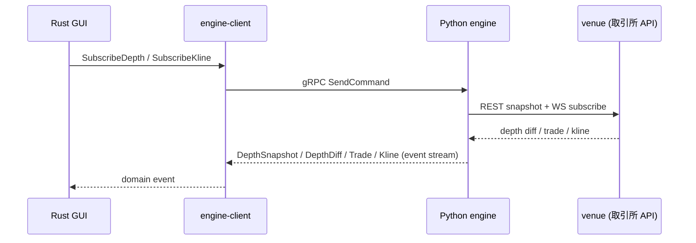

# データフロー

e-station は **live / replay / backtest** の 3 モードでデータパスが異なるが、
Rust ↔ Python の IPC 境界は共通である。

## live モード（市場データ + 注文）

注文系も同じ経路で `PlaceOrder` / `CancelOrder` コマンドを送り、`OrderUpdate` /
`Execution` イベントが逆流する。

## replay モード

`python/engine/replay_session.py` の `ReplaySession` がローカル WAL / 録画データを
時系列に再生し、live と同じイベント形でストリームする。Rust 側はモードを意識せず
同一ハンドラで描画できる（[replay.md](../specs/replay.md)）。

## backtest モード

`python/engine/nautilus/` 配下の nautilus-trader 統合経由で過去データを再生し、
戦略コードの fill / position 結果を `Execution` / `OrderUpdate` イベントとして UI に
返す。詳細は [backtest.md](../specs/backtest.md)。

## 逆流イベント

下記イベントは **Python → Rust の片方向逆流** であり、Rust は受信のみ:

- `EngineBusy` / `EngineStopped` — 状態遷移通知
- `ClientConnected` / `ClientDisconnected` — multi-client broadcast
- `ReplayTimeUpdated` / `ReplayDataLoaded` — replay 進捗
- `VenueReady` / `VenueError` — venue session 状態
- `LiveBuyingPower` / `Execution` — 余力 / 約定

スキーマ全量は [ipc-schema.md](ipc-schema.md) と
[../reference/ipc-protocol.md](../reference/ipc-protocol.md) を参照。
