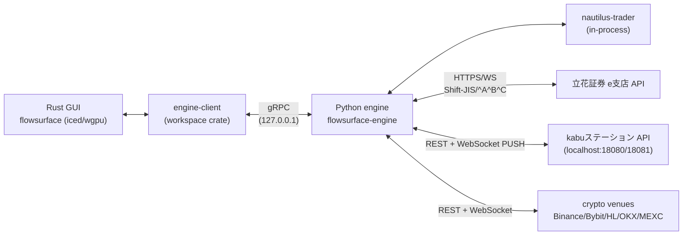

# アーキテクチャ全体像

e-station は **Rust GUI（Iced）+ Python データエンジン** の二プロセス構成で動作する
マーケットデータ可視化アプリケーションである。Rust 側は描画とユーザー操作、Python 側は
取引所 REST/WebSocket 接続・正規化・配信を担当し、両者はローカル gRPC IPC で接続される。

## プロセス構成

## 責務分担

| 層 | 主担当 | 主なソース |
|---|---|---|
| 描画 / UI ステート / ペイン管理 | Rust (`src/`, `data/`) | Iced + wgpu canvas |
| IPC クライアント・プロセス管理・auto-restart | Rust (`engine-client/`) | `engine-client/src/{connection,process,grpc_transport}.rs` |
| 取引所アダプタ（live data） | Python (`python/engine/exchanges/`) | venue 別 fetcher / streamer |
| 注文ライフサイクル | Python (`python/engine/order_router.py`) | nautilus-trader 経由 |
| バックテスト / replay | Python (`python/engine/replay_session.py`, `nautilus/`) | J-Quants データ + nautilus |

## モジュール別詳細

- [data-engine](modules/data-engine.md) — Python 側の中核
- [tachibana-adapter](modules/tachibana-adapter.md) — 立花証券アダプタ
- [kabusapi-adapter](modules/kabusapi-adapter.md) — kabuステーション API アダプタ
- [nautilus-trader](modules/nautilus-trader.md) — backtest / replay エンジン統合
- [ui-shell](modules/ui-shell.md) — Rust 側 UI 構造（メニュー / フッター）

境界の詳細は [boundaries.md](boundaries.md)、データフローは
[data-flow.md](data-flow.md)、IPC スキーマは [ipc-schema.md](ipc-schema.md) を参照。
